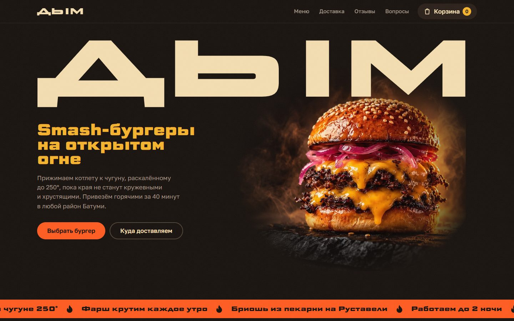
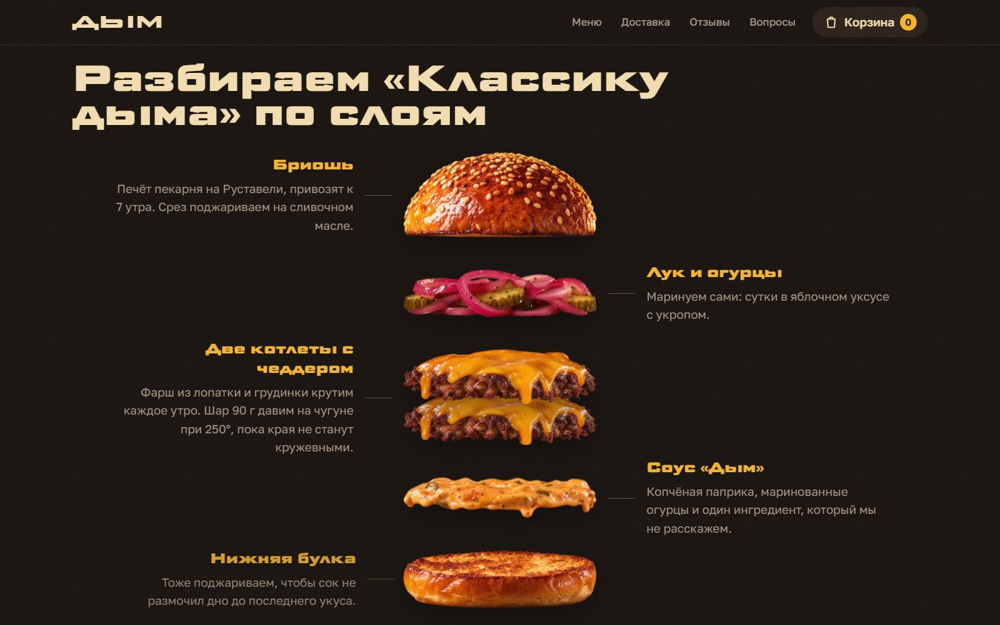
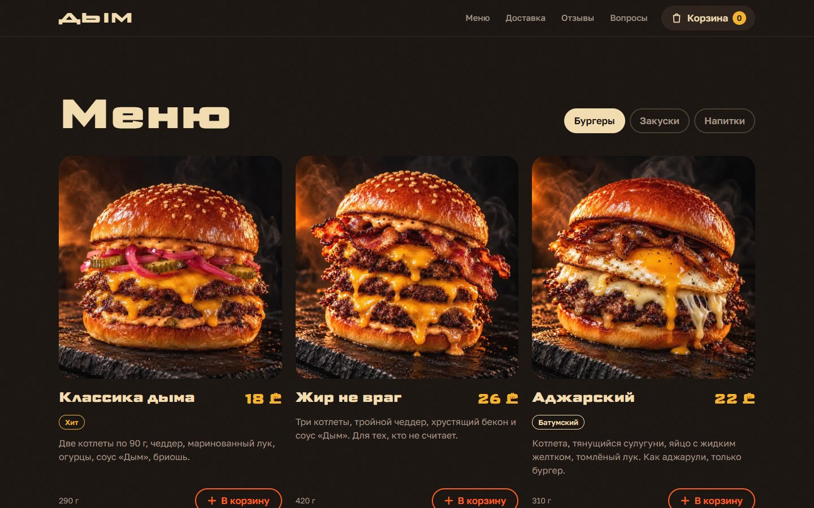
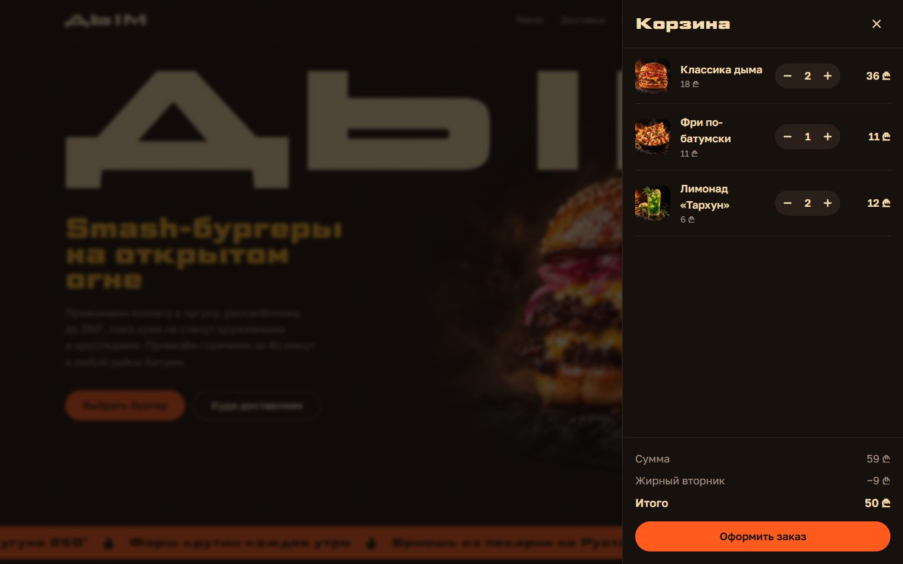
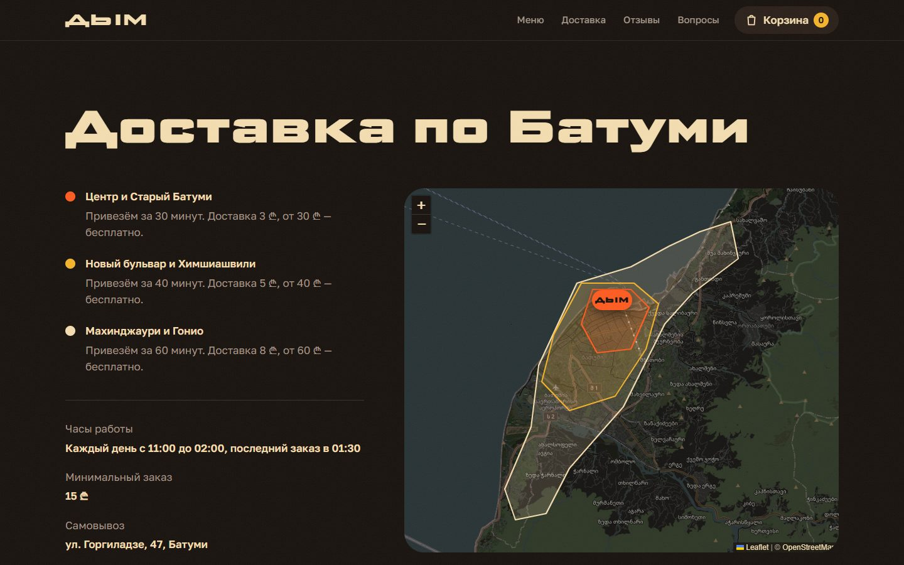
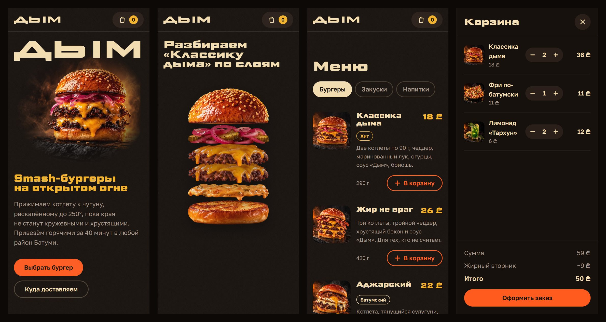

# ДЫМ — лендинг smash-бургерной в Батуми

**Живой сайт:** https://dym-batumi-landing.vercel.app

Демо-проект для портфолио студии **Mr. Web** ([Instagram](https://www.instagram.com/mr.web.batumi)). Бургерная, отзывы и люди вымышленные, фото сгенерированы. Заказ проходит весь путь до экрана «Заказ принят», но никуда не отправляется.



## Задача

Показать владельцу кафе или локального сервиса, что лендинг может одновременно:

- **продавать** — понятный оффер, меню с ценами, корзина и оформление за пару минут, отзывы, условия доставки;
- **запоминаться** — у бургерной свой характер, а не шаблон «фото + три карточки».

Аудитория портфолио смотрит с телефона, поэтому всё проектировалось от мобилки, а бюджет по скорости — Lighthouse mobile ≥ 95.

## Что получилось

### Первый экран: буквы под прессом

Слово ДЫМ появляется узким и «придавливается» до полной ширины — как котлету давят на чугуне. Это не картинка и не JS: у шрифта Science Gothic есть ось ширины 50–200 %, её и анимирует CSS. Буквы подогнаны под ширину экрана через container query units, поэтому слово ровно встаёт в строку на любом устройстве.

### Взрыв-схема вместо блока «Наши преимущества»



Вместо абзацев про «свежие продукты» — «Классика дыма», которая разлетается на слои по прокрутке. У каждого слоя своя подпись: бриошь из пекарни, свой маринад, фарш каждое утро, соус. Сцена прилипает к экрану, пока пользователь листает «взлётную полосу» секции. На мобилке после разлёта слои подсвечиваются по очереди, подпись активного — под бургером.

### Меню и корзина



- Табы «Бургеры / Закуски / Напитки» по паттерну WAI-ARIA: стрелки, Home/End, без JS видно всё меню.
- «В корзину» — копия фото летит по дуге в кнопку корзины, счётчик подпрыгивает в момент приземления.
- Корзина живёт в `localStorage` и синхронизируется между вкладками.
- «Жирный вторник» (второй бургер за полцены) включается сам по времени Батуми. Посмотреть в любой день — [`?tuesday=1`](https://dym-batumi-landing.vercel.app/?tuesday=1).
- Минимальный заказ блокирует оформление и подсказывает, сколько добавить; при доставке — сколько осталось до бесплатной.



Оформление — в той же панели: доставка или самовывоз, телефон с маской `+995`, район, время, оплата. Ошибки подсвечиваются у полей, фокус уходит на первое неверное.

### Доставка на живой карте



Три зоны с разным временем и ценой на карте OpenStreetMap, затемнённой под палитру сайта. Leaflet и тайлы грузятся, только когда пользователь долистал до блока, — на скорость первого экрана карта не влияет. На телефоне карта не перехватывает прокрутку страницы.

### Мобильная версия



## Результаты

Lighthouse на продакшн-сборке, по три прогона:

| | Performance | Accessibility | Best Practices | SEO | LCP | CLS |
|---|---|---|---|---|---|---|
| Мобилка | 98–99 | 100 | 100 | 100 | 2,1 с | 0 |
| Десктоп | 100 | 100 | 100 | 100 | 0,5 с | 0 |

Как этого добились:

- **Фото** — исходники из ChatGPT по 2–3 МБ; на странице — AVIF/WebP под размер экрана через `astro:assets`. Первая загрузка на мобилке — около 210 КБ вместе со шрифтами и скриптами.
- **Шрифты** урезаны до нужных символов и осей: Science Gothic 48 КБ, Golos Text 30 КБ. Пока они грузятся, текст рисуется системным шрифтом, подогнанным по высоте и ширине (`size-adjust`, `ascent-override`), — строки не прыгают при подмене.
- **CSS** встроен в HTML, блокирующих запросов нет. Тяжёлое (Leaflet) грузится лениво.
- **Доступность:** контраст текста по WCAG AA, видимый фокус, работа с клавиатуры, нативный `<dialog>` для корзины, все анимации отключаются при `prefers-reduced-motion`.
- **Превью ссылки** в Telegram и соцсетях — своя OG-картинка 1200×630.

## Стек

- [Astro](https://astro.build) — статическая сборка, ноль JS-фреймворка на клиенте; интерактив — на чистом TypeScript.
- Tailwind CSS 4 — дизайн-токены через `@theme`, стандартная палитра отключена.
- Leaflet + OpenStreetMap — карта зон доставки.
- Vercel — хостинг, превью на каждый pull request.

Работа шла по пяти этапам, каждый — отдельный PR: каркас → дизайн-система и hero → секции → заказ → анимации, фото и полировка. Полное ТЗ и принятые решения — в [docs/spec.md](docs/spec.md).

## Запуск

```bash
npm install
npm run dev      # http://localhost:4321
npm run build    # сборка в dist/
npm run check    # проверка типов
```

Фото: сырые PNG кладутся в `raw-photos/` (не в git), `python scripts/prepare-photos.py` готовит из них исходники в `src/assets/photos/`. Промпты для генерации — в [prompts.md](prompts.md).

---

Дизайн и разработка — **Mr. Web**, лендинги на заказ в Батуми. [Instagram](https://www.instagram.com/mr.web.batumi)
